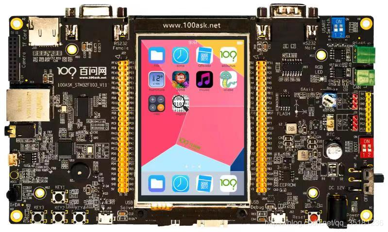

# 说明

[韦东山百问网](https://www.100ask.net)LVGL单片机示例程序，本项目适用于[STM32F103开发板](https://detail.tmall.com/item.htm?id=638105716849)。

| 名称 | 说明 |
| ---- | ---- |
| Core | 从SDK抽取的核心文件，方便修改 | 
| Driver | 用户编写的外设驱动文件 |
| Main | 主函数文件 | 
| Project | 工程文件，包含目标二进制文件 |
| SDK | CMSIS和HAL库，只包含用到的库，添加其它外设需要添加相应库 | 
| Clean.bat | 清理工程产生的文件，缩小体积，方便拷贝 | 
| Readme.txt | 工程说明文件 |

# 韦东山百问网LVGL教程
## 视频教程

视频教程准备中，获取更新动态，请关注(任意一个)：

- [https://space.bilibili.com/275908810](https://space.bilibili.com/275908810)
- [https://www.100ask.net](https://www.100ask.net)

## 文档教程
- [http://lvgl.100ask.net/](http://lvgl.100ask.net/)

# 开发板购买地址

- [STM32F103开发板](https://detail.tmall.com/item.htm?id=638105716849)：[https://detail.tmall.com/item.htm?id=638105716849](https://detail.tmall.com/item.htm?id=638105716849)

